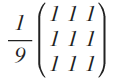

## WebCV - Blazingly fast computer vision in the browser

WebCV is a [computer vision](https://en.wikipedia.org/wiki/Computer_vision) library written in [TypeScript](http://www.typescriptlang.org/)
and compiled into JavaScript, it uses the [WebGL](https://developer.mozilla.org/en/docs/Web/API/WebGL_API) API and it's GLSL ES 2.0 capacities
in order to apply filters to images using the GPU.

### The basics

##### Creating a *Context* :
The *Context* class initiates some default GLSL vertex and fragment shaders required for any GLSL program.

In order to create a *Context*, one needs to provide WebCV with an HTML5 canvas element and at least one image :

```javascript
var tex = new wcv.Texture('#lena'),
	ctx = new wcv.Context('#canvas', tex);
	
var fragmentShader = ctx.fs,
	vertexShader = ctx.vs;
		
//manipulate the shaders...
```
	
One can then access some public variables from the vertex and fragment shaders :

```javascript
	
var pinkify = vec4(0.4, 0, 0.4, 1);
	
ctx.fragColor.set(ctx.fragColor.add(pinkify)); //La vie en rose
```

Once every instructions given, one needs to call the *render()* function of the given Context to run the program, so that we have :

```javascript
var tex = new wcv.Texture('#lena'),
	ctx = new wcv.Context('#canvas', tex);
	
var purpleize = vec4(0, 0, 0.7, 1);

ctx.fragColor.set(ctx.fragColor.add(purpleize)); //La vie en rose
	
ctx.render();	
```
	
The above example uses built-in wcv functions to manipulate the underlying shaders, however, if you want and know how to, you can 
edit the programs directly in GLSL ES 2.0 :

```javascript
var tex = new wcv.Texture('#lena'),
	ctx = new wcv.Context('#canvas', tex);
	
	ctx.fs.main.append(
		'vec4 purpleize = vec4(0, 0, 0.7, 1)',
		'fragColor = fragColor + purpleize'
	);
	
	ctx.render();
```
	
both of the above will produce the following result :

[](https://jsfiddle.net/nathsou/b03391kz/5/)
	
### Going a bit further

##### WebCV comes in with a bunch of useful functions and filters :

- Convolution

A lot of very interesting effects can be applied thanks to a [convolution kernel](https://en.wikipedia.org/wiki/Kernel_(image_processing))

Let's apply the [following kernel](http://homepages.inf.ed.ac.uk/rbf/HIPR2/mean.htm) to our image :



WebCV provides a *convolution* function, ready to use as follows :

```javascript
var kernel = [1/9, 1/9, 1/9, 1/9, 1/9, 1/9, 1/9, 1/9, 1/9];
	
var conv = ctx.convolution(tex, kernel);
	
ctx.fragColor.set(conv);
```

This kernel blurs the image : 

[](https://jsfiddle.net/nathsou/b03391kz/1/)

#### Sobel operator

A very common filter in computer vision is the [Sobel Operator](https://en.wikipedia.org/wiki/Sobel_operator) which 
highlights image's contours.

Usage : 

```javascript

var GradientIntensity = ctx.sobel(tex);  //returns a float

ctx.fragColor.set(vec4(vec3(GradientIntensity), 1));
```

Result : 

[](https://jsfiddle.net/nathsou/b03391kz/4/)

#### Posterize

Usage : 

```javascript

var posterize = ctx.posterize(ctx.fragColor, gamma?, numColors?);  //returns a vec4

ctx.fragColor.set(vec4(vec3(posterize), 1));
```

Result : 

[](https://jsfiddle.net/nathsou/b03391kz/2/)

#### Combining GLSL & JavaScript

One can easily combine WebCV built-in functions and GLSL code inside the *append()* function call :

```javascript
var G = ctx.sobel(tex);
	
ctx.fs.main.append(
	'vec4 color = vec4(vec3(0), 1)',
	_if(len(distance(ctx.fragColor, vec4(0.75, 0.31, 0.34, 1))).lss(float(0.15)),
		'color = ' + vec4(0, 1, 0, 1)
	)

);
	
ctx.fragColor.set('color');
```

Result :

[](https://jsfiddle.net/nathsou/b03391kz/3/)

### Extending WebCV

WebCV lets you add your own functions to the core library